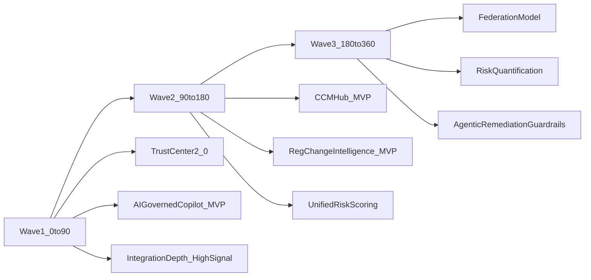

# Platform Additions Roadmap 2026

## Objective

Define a prioritized product expansion roadmap that strengthens GigaChad GRC competitiveness across both SMB/mid-market and enterprise buyers.

## Guiding Product Principles

- **Trust operations, not checkbox compliance:** connect assurance work to risk reduction and revenue outcomes.
- **AI with governance by design:** every AI-generated artifact must be reviewable, attributable, and policy-constrained.
- **Continuous over periodic:** make control health, evidence freshness, and drift visible in near real time.
- **Package for outcomes:** bundle features around buyer jobs, not internal module boundaries.

## Priority Additions (Ranked)

### P1. Regulatory Change Intelligence Engine

**What to add**

- Regulatory/library delta ingestion and normalization.
- Impact graph: regulation -> control -> policy -> test -> owner.
- Guided “what changed / what broke / what to update” workspace.

**Why now**

- Regulatory velocity is increasing, and manual change interpretation is a major enterprise pain point.

**Primary buyer value**

- Faster adaptation to new obligations with less manual triage.

### P1. Continuous Controls Monitoring (CCM) Hub

**What to add**

- Unified control health score (design + operating effectiveness).
- Drift alerts and SLA-based remediation routing.
- Evidence freshness index and attestation confidence scoring.

**Why now**

- Market baseline moved from periodic readiness to continuous assurance.

**Primary buyer value**

- Reduced audit fire drills and improved control reliability.

### P1. Trust Center + Questionnaire Automation 2.0

**What to add**

- Dynamic trust artifacts linked to live control/evidence state.
- AI-assisted questionnaire answer generation with confidence score.
- Deal desk workflow: approver gates + SLA + audit trail.

**Why now**

- Trust workflows now directly influence sales velocity.

**Primary buyer value**

- Faster security reviews, reduced sales friction, and better proof of security posture.

### P2. TPRM Intelligence Fusion

**What to add**

- External risk signal ingestion (ratings/attack-surface events).
- Auto-tiering and event-driven reassessment triggers.
- Residual risk model combining internal questionnaire + external posture.

**Why now**

- Buyers increasingly expect both internal assessment and external continuous monitoring.

**Primary buyer value**

- Better third-party visibility and earlier warning on vendor risk changes.

### P2. AI Control Copilot (Governed)

**What to add**

- Draft control narratives, test procedures, policy updates, remediation plans.
- Required reviewer sign-off and immutable generation log.
- Prompt/response provenance and model-policy guardrails.

**Why now**

- AI demand is high, but governance expectations are rising equally fast.

**Primary buyer value**

- Higher team throughput with lower governance risk.

### P3. Executive Risk Quantification Layer

**What to add**

- Scenario-based financial risk ranges.
- Control ROI and remediation prioritization scorecards.
- Board reporting templates by risk domain.

**Why now**

- Board engagement is increasing; qualitative-only views are often insufficient.

**Primary buyer value**

- Stronger executive decision support and budget justification.

### P3. Enterprise Federation and Delegated Governance

**What to add**

- Multi-entity control ownership and cross-entity rollups.
- Delegated admin and approval chains by legal entity or region.
- Policy exception lifecycle with expiry, approvals, and compensating controls.

**Why now**

- Large buyers need a federated operating model beyond single-org assumptions.

**Primary buyer value**

- Scalable governance across complex organizational structures.

## Packaging Strategy

### SMB/Mid-Market Package: Trust Acceleration

- Continuous compliance automation.
- Trust center + questionnaire automation.
- Lightweight TPRM and AI drafting assistant.
- Quick-start templates and opinionated default workflows.

### Enterprise Package: Resilience and Federated Assurance

- CCM hub + regulatory intelligence.
- Advanced TPRM with external signal fusion.
- Quantified risk and board dashboards.
- Federation controls (multi-entity, delegated governance, exception management).

## 12-Month Delivery Sequencing

## Success Metrics

### Product/Operational

- Time-to-audit-readiness reduction.
- % controls with fresh evidence.
- Mean time to control drift resolution.
- Questionnaire response cycle time.

### Business

- Deal-cycle reduction for security reviews.
- Expansion rate in multi-module customers.
- Enterprise win rate for regulated buyers.
- Gross retention improvement from workflow stickiness.

## Risks and Mitigations

- **Risk:** AI output quality variability.  
  **Mitigation:** confidence scoring + human gate + provenance logs.
- **Risk:** CCM coverage gaps in hard-to-integrate systems.  
  **Mitigation:** layered collection model (API, file/log ingest, custom collectors).
- **Risk:** Roadmap spread too broad.  
  **Mitigation:** enforce wave gates and measurable exit criteria.

## Dependencies

- Strong shared data model across controls, policies, risks, audit, trust, and TPRM.
- Integration framework hardening (retry semantics, sync health, backfill tooling).
- Role/permission extensions for delegated governance workflows.

## Additional Improvements (Addendum)

### Newly Added P1 (Near-Term)

- Guided Program Onboarding and Maturity Assistant.
- Evidence Lineage and Attestation Chain.
- Reliability and Operability Console for integration/job health.

### Newly Added P2 (Mid-Term)

- Assurance API and customer-facing control assertion bundles.
- Partner/marketplace extension framework for integrations.
- Pricing and value instrumentation layer for expansion optimization.

### Newly Added P3 (Long-Term)

- Policy-as-Code and Control-as-Code workspace.
- Benchmarking and peer risk intelligence.

### Integration Into Existing Wave Plan

- **Wave 1:** include Guided Onboarding + Reliability Console.
- **Wave 2:** include Evidence Lineage + Assurance API discovery.
- **Wave 3:** include Policy-as-Code and Benchmarking Intelligence after federation readiness gates.

## References

- [Platform market landscape](./PLATFORM_MARKET_LANDSCAPE_2026.md)
- [Additional improvements gap analysis](./PLATFORM_ADDITIONS_GAP_ANALYSIS_2026.md)
- [Architecture baseline](./ARCHITECTURE.md)
- [Module baseline](./MODULE_CONFIGURATION.md)
